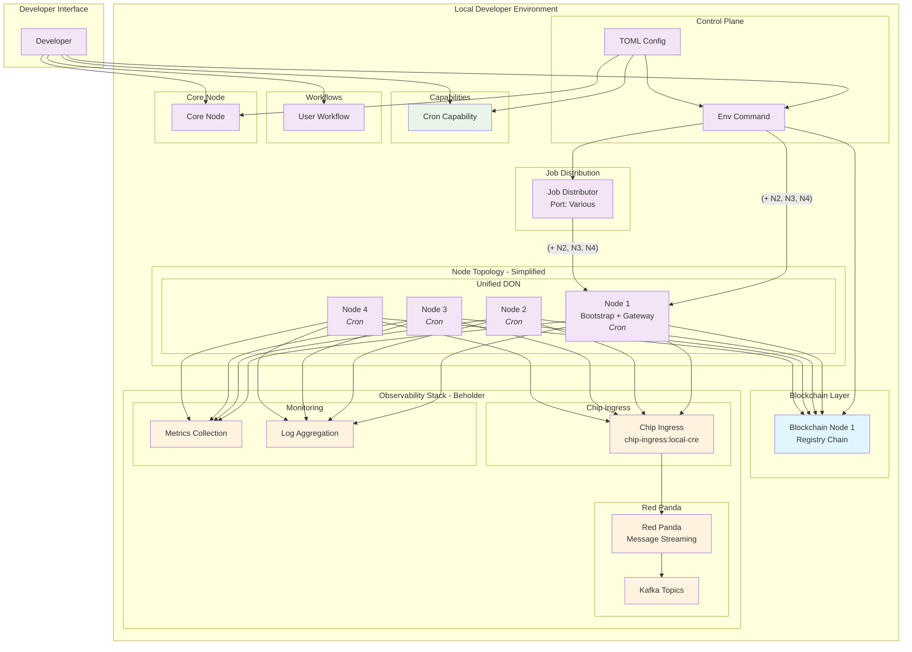

# CRE Local Developer Environment - Component Diagram

## Architecture Overview

### **Control Plane**
- **Setup Command**: Handles prerequisite checks and environment initialization
- **TOML Config**: Configuration files defining node sets, capabilities, and infrastructure

### **Node Topologies**

#### **Simplified Topology**
- Single unified DON with all capabilities
- Node 1 acts as both Bootstrap and Gateway
- All nodes share the same capability set

### **Capabilities**
- **Cron**: Scheduled task execution

### **Observability Stack (Beholder)**
- **Chip Ingress**: Data collection and routing service
- **Red Panda**: Kafka-compatible message streaming
- **Monitoring**: Metrics collection and log aggregation

### **Developer Interface**
- **CLI Commands**: Direct environment control
- **Browser UI**: Gateway web interface
- **Terminal**: Development workflow integration

## Key Features

1. **Capability Distribution**: Flexible assignment of capabilities across different node types
2. **Observability Integration**: Built-in monitoring and logging via Beholder stack
3. **Docker-based**: Containerized deployment for consistency and isolation
4. **Developer-friendly**: Simple CLI commands for environment management

### Advanced Features
#### **Full Topology**
- **Workflow DON**: Handles workflow execution (OCR3, Compute, WebAPI, Cron, LogEvent)
- **Capabilities DON**: Manages blockchain interactions (WriteEVM, ReadContract, WebAPI)
- **Gateway DON**: Provides external interface and routing
#### **Capabilities** In Progress...
- **OCR3**: Off-chain reporting consensus mechanism
- **Custom Compute**: Computational workflows
- **WebAPI**: HTTP triggers and targets
- **WriteEVM**: Blockchain write operations
- **Cron**: Scheduled task execution
- **LogEvent**: Blockchain event monitoring
- **ReadContract**: Smart contract reading