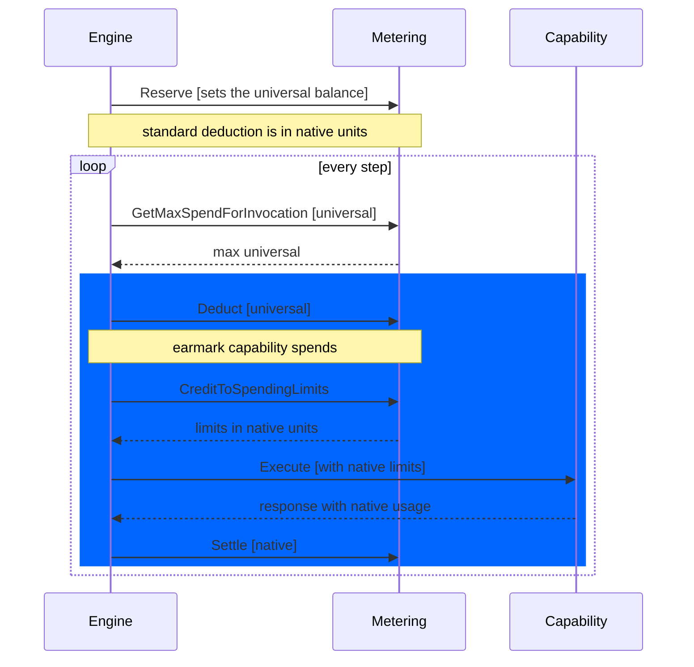
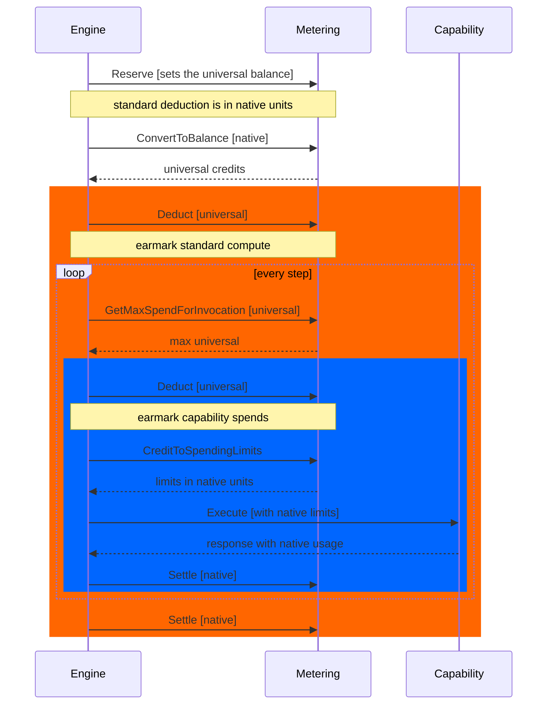

## Engine v1 Metering Sequence

The v1 engine does not make a standard deduction and so does not need to do any direct conversions to universal credits.

## Engine v2 Metering Sequence

The v2 engine makes a standard deduction for all workflow invocations where the native units are `Compute`. To use the 
same interface flow of `Deduct` and `Settle`, the native units must be converted to universal units. To accomplish this,
a special function must be available to convert native units to universal for deduct to function.

