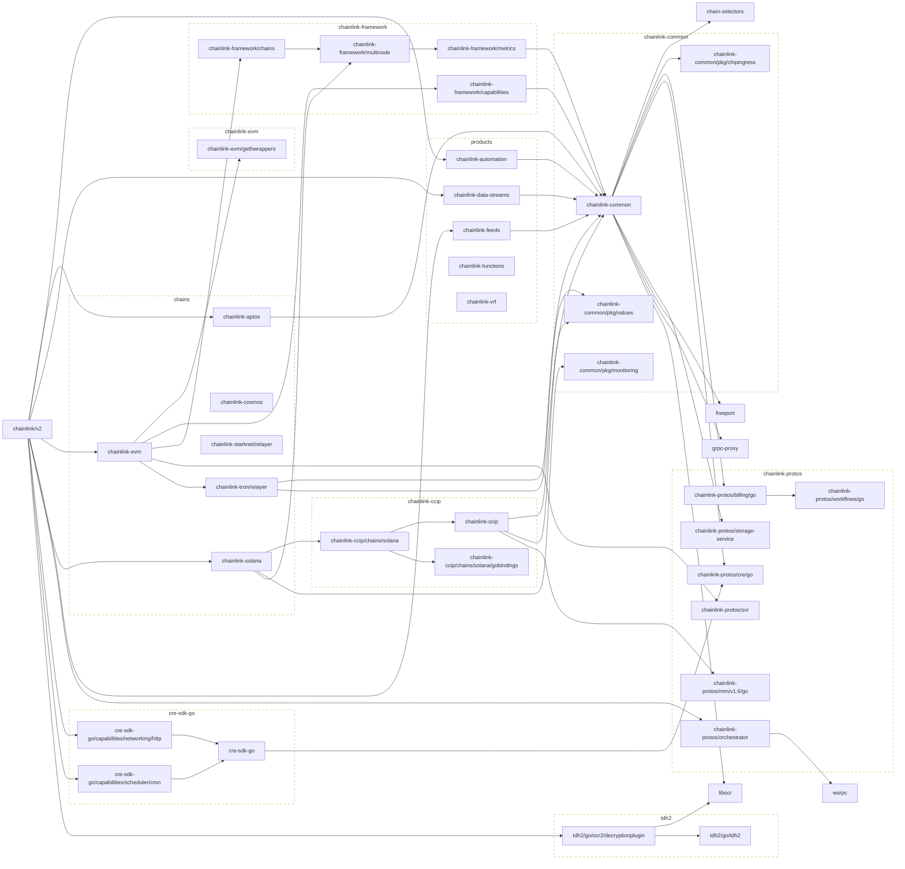

# smartcontractkit Go modules
## Main module

## All modules
```mermaid
flowchart LR
  subgraph chains
    chainlink-aptos
    chainlink-cosmos
    chainlink-evm
    chainlink-solana
    chainlink-starknet/relayer
    chainlink-tron/relayer
  end

  subgraph products
    chainlink-automation
    chainlink-data-streams
    chainlink-feeds
    chainlink-functions
    chainlink-vrf
  end

  classDef group stroke-dasharray:6,fill:none;
  class chains,products group


	classDef outline stroke-dasharray:6,fill:none;
	class  outline
```
